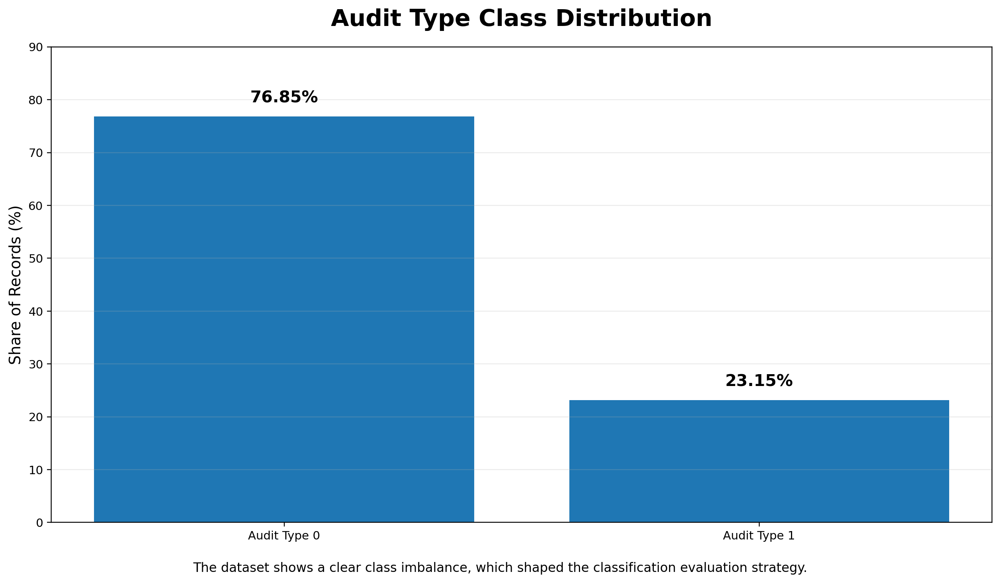
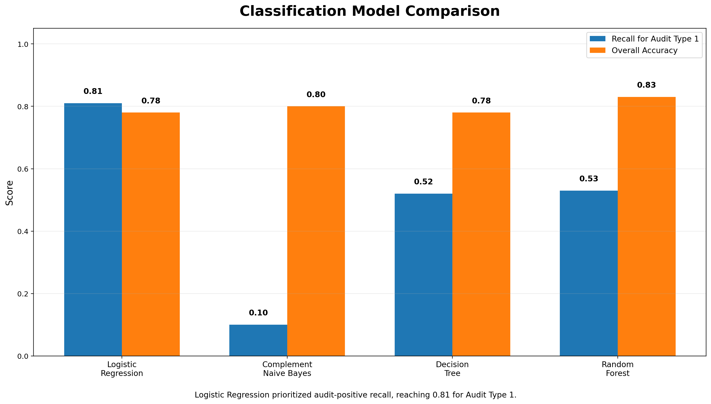

# Predictive Audit Risk Analysis

## Project Overview
This Python and Google Colab project applies data mining techniques to analyze audit outcomes and support more efficient audit decision-making. The analysis uses a **2,000-record audit dataset** to examine income patterns, prepare the data for modeling, and build predictive workflows for both regression and classification.

The project focuses on two analytical goals:
- Predicting **Income** through regression analysis
- Classifying **Audit_Type** to help identify individuals more likely to require an audit

## Tools Used
- Python
- Google Colab / Jupyter Notebook
- Pandas
- NumPy
- Matplotlib / Seaborn
- Scikit-learn
- Regression Analysis
- Classification Modeling
- Exploratory Data Analysis

## Data Preparation
The workflow included:
- Reviewing data structure and variable types
- Identifying and addressing **201 missing values** across Employment and Occupation fields
- Removing non-analytical identifier fields
- Converting categorical variables into dummy variables for modeling
- Preparing a fully numeric modeling dataset

## Exploratory Data Analysis
The EDA explored:
- Income distribution and right-skewness
- Age, hours worked, and deductions patterns
- Potential outliers affecting regression results
- Audit class imbalance, where **76.85%** of records were in one class and **23.15%** were in the other

### Audit Class Imbalance

## Modeling Workflow

### Regression Analysis
A linear regression model was developed to predict **Income** using demographic, employment, education, occupation, and work-related predictors. The model provided interpretable coefficients and helped assess which factors were associated with higher or lower predicted income.

### Classification Analysis
Multiple classification models were evaluated to predict **Audit_Type**, including:
- Logistic Regression
- Complement Naive Bayes
- Decision Tree
- Random Forest

The project prioritized **recall for the audit-positive class**, since identifying individuals who should be audited was more important than only maximizing overall accuracy.

### Classification Model Comparison

## Key Findings
- The dataset contained **2,000 observations**
- **201 missing values** were identified and handled during preprocessing
- Audit outcomes showed a clear **76.85% vs. 23.15% class imbalance**
- Income was strongly right-skewed, which affected modeling considerations
- Logistic Regression was selected as the preferred classification approach because it produced the strongest recall for identifying audit-positive cases
- The analysis also considered limitations, including fairness, bias risk, and the need for careful real-world interpretation

## File Included
- `predictive_audit_risk_analysis.ipynb` – Full Google Colab / Jupyter Notebook with preprocessing, EDA, regression, classification, model evaluation, and business recommendations

## Portfolio Focus
This project demonstrates my ability to:
- Clean and preprocess structured business data
- Conduct exploratory analysis and interpret patterns
- Build regression and classification models
- Compare model performance using business-relevant metrics
- Translate technical results into practical recommendations
